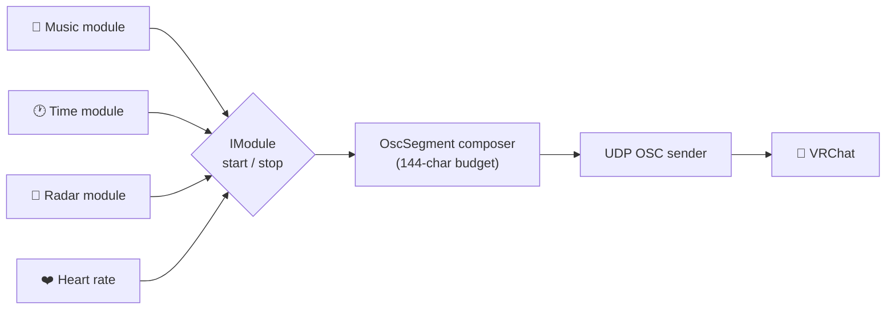

<div align="center">


# Overline

**Your VRChat chatbox, rebuilt.** One line above your head, assembled from
independent modules — music, stats, radar, heart rate — with privacy consent
first and a hard 144-character budget.

[](#)<!--
-->[](https://dotnet.microsoft.com/)<!--
-->[](#)<!--
-->[](#)<!--
-->[](https://github.com/youtsuhodev/overline/stargazers)<!--
-->[](https://github.com/youtsuhodev/overline/forks)<!--
-->[](https://github.com/youtsuhodev/overline/commits/main)<!--
-->[](#)<!--
-->[](#)

</div>

---

> [!NOTE]
> This is the ground-up rewrite of **MagicChatBox (v2)**. The complete legacy
> codebase is preserved untouched in [`OLD/`](OLD/) for reference only — do not
> build or edit it; it exists to mine features for porting into Overline.

---

## 📑 Table of contents

<details>
<summary>Click to expand</summary>

- [✨ Features](#-features)
- [🧱 Architecture](#-architecture)
  - [Project layout](#project-layout)
  - [Module flow](#module-flow)
  - [Design principles](#design-principles)
- [🚀 Getting started](#-getting-started)
  - [Prerequisites](#prerequisites)
  - [Build & test](#build--test)
  - [Run](#run)
- [📦 Build the installer](#-build-the-installer)
  - [Outputs](#outputs)
- [🗺️ Roadmap](#️-roadmap)
- [🤝 Contributing](#-contributing)
- [⭐ Star history](#-star-history)

</details>

---

## ✨ Features

- [x] **Modular chatbox** — each feature is an isolated module (`music`, `stats`, `radar`, `heart rate`, …)
- [x] **Privacy consent first** — modules must check consent before touching sensitive data
- [x] **Hard 144-character budget** — priority-based `OscSegment` composer drops content gracefully
- [x] **OSC on UDP** — talks directly to VRChat, no dependencies
- [x] **Typed settings** — per-section POCOs persisted to `%APPDATA%/Overline/settings/*.json`
- [ ] **OSC Mapping module** — bind any data to avatar parameters, no code *(roadmap)*
- [ ] **OBS integration** — scene & recording status via obs-websocket *(roadmap)*

## 🧱 Architecture

### Project layout

| Project | Role |
| :--- | :--- |
| `Overline.Core` | Contracts & pure logic — `IModule`, settings store, OSC encoder, line builder, privacy consent, clock |
| `Overline.Modules.Time` | Reference module — local time + emoji clock face |
| `Overline.App` | WPF shell — DI wiring, UDP OSC sender, main window |
| `Overline.Tests` | xUnit tests (Core + modules) |
| `Overline.slnx` | Solution — .NET 10, modern XML solution format |

### Module flow



### Design principles

> **Core has zero platform dependencies.** Everything in `Overline.Core` is pure
> .NET — testable on any OS, no WPF, no Windows-only APIs.

> **Modules are isolated.** Each module implements `IModule` (start/stop state
> machine) and contributes `OscSegment`s with a priority used to drop content
> gracefully when the 144-character budget overflows.

> **Privacy consent is a Core primitive.** Modules must check
> `IPrivacyConsentService.IsApproved(hook)` before touching sensitive data.

> **Settings are typed and per-section.** `ISettingsStore` persists small POCOs
> per key into `%APPDATA%/Overline/settings/*.json`.

> **Warnings are errors.** `Directory.Build.props` enforces
> `TreatWarningsAsErrors`; package versions are centralized in
> `Directory.Packages.props`; the SDK is pinned in `global.json`.

## 🚀 Getting started

### Prerequisites

- [.NET 10 SDK](https://dotnet.microsoft.com/download) — see `global.json`
- *(installer only)* [Inno Setup 6](https://jrsoftware.org/isinfo.php) — `winget install JRSoftware.InnoSetup`

### Build & test

```bash
dotnet build Overline.slnx
dotnet test  Overline.slnx
```

> [!TIP]
> `TreatWarningsAsErrors` is on — any warning fails the build. Fix the warning,
> don't suppress it.

### Run

```bash
dotnet run --project Overline.App
```

## 📦 Build the installer

`build-installer.bat` publishes a self-contained `Overline.exe` (no .NET install
needed) and compiles it into an Inno Setup installer:

```bash
build-installer.bat
```

> [!IMPORTANT]
> The `.bat` delegates to `build-installer.ps1` (a `.bat` alone can't parse
> `<`/`>` for the version tag). The version is read from `<Version>` in
> `Directory.Build.props`.

### Outputs

Under `artifacts/` *(gitignored)*:

| Output | Description |
| :--- | :--- |
| `artifacts\publish\win-x64\Overline.exe` | Portable single-file build |
| `artifacts\installer\Overline-Setup-<version>.exe` | Installer with Start-menu shortcut, optional desktop shortcut, uninstaller, FR/EN languages |

## 🗺️ Roadmap

*Validated audit — not yet started:*

- [ ] CI test gate *(the legacy repo never ran its 167 test files in CI)*
- [ ] OSC Mapping module — bind any data to avatar parameters, no code
- [ ] OBS integration — scene, recording status via obs-websocket
- [ ] Kick / YouTube Live alongside Twitch / TikTok
- [ ] Local AI (Ollama-compatible) for IntelliChat-style features
- [ ] Session analytics from VRChat log radar
- [ ] MagicChatboxAPI as a real SDK — community plugin loader
- [ ] Profile manager UI (SFW/NSFW, FR/EN switching)

## 🤝 Contributing

1. 🍴 Fork the repo and create a branch: `git checkout -b feat/my-feature`
2. 🛠️ Implement — keep `Overline.Core` platform-free, keep modules isolated
3. ✅ Add tests, run `dotnet test Overline.slnx` (warnings fail the build)
4. 🚀 Open a pull request

> [!NOTE]
> Questions or ideas? Open an [issue](https://github.com/youtsuhodev/overline/issues)
> — or check the roadmap for things that need a champion.

## ⭐ Star history

<a href="https://star-history.com/#youtsuhodev/overline&Date">
  <picture>
    <source media="(prefers-color-scheme: dark)" srcset="https://api.star-history.com/svg?repos=youtsuhodev/overline&type=Date&theme=dark" />
    
  </picture>
</a>

---

<div align="center">

<sub>Built with 💜 and .NET 10 · Overline · `v0.1.0`</sub>

</div>